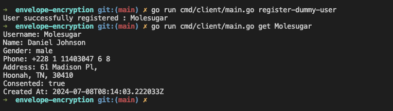
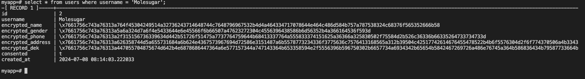

# Envelope Encryption

## Prerequisites

- `Tilt` refers to https://docs.tilt.dev/install
- `Docker` refers to https://docs.docker.com/get-docker/

## Getting started

1. Run the dependencies with following command

    ```
    tilt up
    ```

    It will provisions postgresql, hashicorp vault, unseal the vault and put the root token on `./dev/vault_init_keys.txt`.

2. Configure vault

    Login to vault, use the root token from `./dev/vault_init_keys.txt`.
    ```
    export VAULT_ADDR=https://localhost:8200
    export VAULT_SKIP_VERIFY=true

    vault login
    ```

    Enable `transit` secret engine and then make a new `kek` with the name `myapp`.

    ```
    vault secrets enable transit
    vault write -f transit/keys/myapp
    ```

3. Configure dotenv

    Copy `.env.example` to `.env`
    ```
    cp .env.example .env
    ```

    Change the `VAULT_TOKEN` on `.env` file to your root token (you can get it from `./dev/vault_init_keys.txt`)
    ```
    VAULT_TOKEN=<your root token>
    ```

    NOTE: using root tokens is not recommended for production environments

4. Run the server

    basically a http server that handle 2 endpoint

    ```
    POST /users
    GET /users/{username}
    ```

    ```
    go run cmd/server/main.go
    ```

5. Run the client

    actually we can use curl or postman to access the server, but to make the demo easier, I made an http client to create a dummy user and query the user with the username

    

6. Check the database record and make sure the column is encrypted

    

